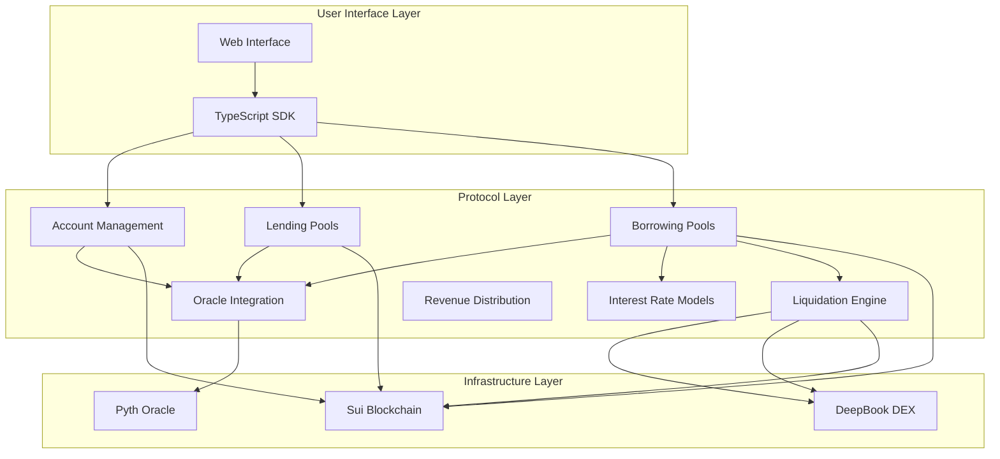
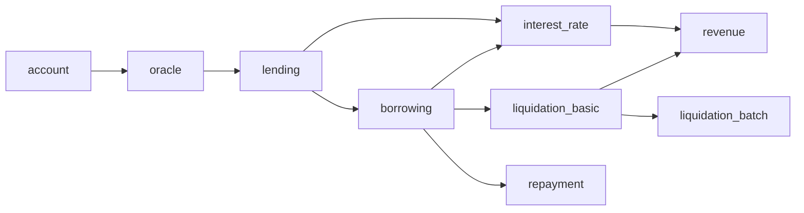

# Olend MVP Design Document

## Overview

Olend is a decentralized lending protocol built on Sui blockchain that implements unified liquidity pools with advanced borrowing mechanisms. The design follows a modular architecture with capability-based security, optimized for capital efficiency and gas performance. The system supports multiple collateral types, dynamic interest rates, and implements an innovative tick-based batch liquidation system.

## Architecture

### High-Level System Architecture



### Module Dependencies



## Components and Interfaces

### 1. Account Management Module (`account.move`)

#### Core Objects

```move
/// Global registry for all user accounts
struct AccountRegistry has key {
    id: UID,
    accounts: Table<address, ID>, // user_address -> account_id
    total_users: u64,
    version: u64
}

/// Individual user account with position tracking
struct Account has key {
    id: UID,
    owner: address,
    lending_positions: Table<TypeName, LendingPosition>,
    borrowing_positions: Table<ID, BorrowingPosition>, // pool_id -> position
    total_collateral_value: u64, // USD value with 8 decimals
    total_debt_value: u64, // USD value with 8 decimals
    health_factor: u64, // 8 decimal precision, 1.0 = 100000000
    created_at: u64,
    last_updated: u64
}

/// Non-transferable capability for account access
struct AccountCap has key {
    id: UID,
    account_id: ID,
    owner: address
}

/// Position in lending pools
struct LendingPosition has store {
    ytoken_balance: u64,
    underlying_deposited: u64,
    interest_earned: u64,
    last_interaction: u64
}

/// Position in borrowing pools  
struct BorrowingPosition has store {
    pool_id: ID,
    collateral_ytokens: Table<TypeName, u64>, // YToken type -> amount
    borrowed_amounts: Table<TypeName, u64>, // Asset type -> amount
    interest_rate: u64, // 8 decimal precision
    last_interest_update: u64,
    created_at: u64,
    health_factor: u64
}
```

#### Key Functions

```move
public fun create_account(ctx: &mut TxContext): (Account, AccountCap)
public fun get_account_health(account: &Account): u64
public fun update_lending_position(account: &mut Account, cap: &AccountCap, ...)
public fun update_borrowing_position(account: &mut Account, cap: &AccountCap, ...)
```

### 2. Oracle Integration Module (`oracle.move`)

#### Core Objects

```move
/// Oracle price feed manager
struct OracleRegistry has key {
    id: UID,
    price_feeds: Table<TypeName, PriceFeed>,
    admin_cap: ID,
    staleness_threshold: u64, // seconds
    circuit_breaker_threshold: u64 // percentage change that triggers circuit breaker
}

/// Individual price feed configuration
struct PriceFeed has store {
    pyth_price_id: vector<u8>,
    decimal_precision: u8,
    last_price: u64,
    last_update: u64,
    confidence_interval: u64,
    is_active: bool
}

/// Price data with validation
struct PriceData has drop {
    price: u64, // USD price with 8 decimals
    confidence: u64,
    timestamp: u64,
    is_valid: bool
}
```

#### Key Functions

```move
public fun get_price<T>(registry: &OracleRegistry): PriceData
public fun get_usd_value<T>(registry: &OracleRegistry, amount: u64): u64
public fun validate_price_freshness(feed: &PriceFeed, current_time: u64): bool
public fun update_price_feed<T>(registry: &mut OracleRegistry, ...)
```

### 3. Unified Lending Module (`lending.move`)

#### Core Objects

```move
/// Unified liquidity pool for each asset type
struct LendingPool<phantom T> has key {
    id: UID,
    total_deposits: Balance<T>,
    total_ytokens: u64,
    exchange_rate: u64, // 8 decimal precision
    interest_rate_model: InterestRateModel,
    last_interest_update: u64,
    total_borrowed: u64,
    reserve_factor: u64, // percentage for protocol revenue
    is_paused: bool
}

/// Yield-bearing token representing pool shares
struct YToken<phantom T> has key {
    id: UID,
    balance: u64
}

/// Interest rate model configuration
struct InterestRateModel has store {
    base_rate: u64, // 8 decimal precision
    optimal_utilization: u64, // 8 decimal precision  
    slope1: u64, // rate below optimal utilization
    slope2: u64, // rate above optimal utilization
    reserve_factor: u64
}
```

#### Key Functions

```move
public fun deposit<T>(pool: &mut LendingPool<T>, deposit: Coin<T>, account: &mut Account, cap: &AccountCap): YToken<T>
public fun withdraw<T>(pool: &mut LendingPool<T>, ytoken: YToken<T>, account: &mut Account, cap: &AccountCap): Coin<T>
public fun calculate_exchange_rate<T>(pool: &LendingPool<T>): u64
public fun update_interest_rates<T>(pool: &mut LendingPool<T>)
```

### 4. Single-Asset Borrowing Module (`borrowing.move`)

#### Core Objects

```move
/// Single collateral, single borrow asset pool
struct BorrowingPool<phantom C, phantom T> has key {
    id: UID,
    collateral_factor: u64, // max 90% for volatile, 95% for stable
    liquidation_threshold: u64, // typically 5% below collateral_factor
    liquidation_bonus: u64, // 5-10% bonus for liquidators
    interest_rate_model: InterestRateModel,
    total_collateral: u64, // in YToken<C> units
    total_borrowed: u64, // in T units
    positions_by_health: Table<u64, vector<ID>>, // health_factor -> position_ids
    is_active: bool,
    created_at: u64
}

/// Borrowing position tracking
struct Position has key {
    id: UID,
    borrower: address,
    pool_id: ID,
    collateral_amount: u64, // YToken<C> amount
    borrowed_amount: u64, // T amount
    interest_rate: u64,
    last_interest_update: u64,
    health_factor: u64,
    created_at: u64
}
```

#### Key Functions

```move
public fun create_pool<C, T>(collateral_factor: u64, liquidation_threshold: u64, ...): BorrowingPool<C, T>
public fun borrow<C, T>(pool: &mut BorrowingPool<C, T>, collateral: YToken<C>, borrow_amount: u64, ...): (Coin<T>, Position)
public fun calculate_health_factor<C, T>(pool: &BorrowingPool<C, T>, position: &Position, oracle: &OracleRegistry): u64
public fun update_position_health<C, T>(pool: &mut BorrowingPool<C, T>, position: &mut Position, ...)
```

### 5. Interest Rate Management Module (`interest_rate.move`)

#### Core Objects

```move
/// Kinked interest rate model implementation
struct KinkedRateModel has store {
    base_rate_per_second: u64,
    multiplier_per_second: u64, // slope1
    jump_multiplier_per_second: u64, // slope2  
    optimal_utilization: u64,
    reserve_factor: u64
}

/// Interest calculation utilities
struct InterestCalculator has drop {
    principal: u64,
    rate_per_second: u64,
    time_elapsed: u64,
    compound_factor: u64
}
```

#### Key Functions

```move
public fun calculate_borrow_rate(model: &KinkedRateModel, utilization: u64): u64
public fun calculate_supply_rate(borrow_rate: u64, utilization: u64, reserve_factor: u64): u64
public fun compound_interest(principal: u64, rate_per_second: u64, time_elapsed: u64): u64
public fun get_utilization_rate(total_borrowed: u64, total_deposits: u64): u64
```

### 6. Basic Liquidation Module (`liquidation_basic.move`)

#### Core Objects

```move
/// Liquidation engine for managing underwater positions
struct LiquidationEngine has key {
    id: UID,
    liquidation_incentive: u64, // bonus percentage for liquidators
    close_factor: u64, // max percentage of debt that can be liquidated
    min_health_factor: u64, // threshold for liquidation eligibility
    liquidator_registry: Table<address, LiquidatorInfo>
}

/// Liquidator information and statistics
struct LiquidatorInfo has store {
    total_liquidations: u64,
    total_volume: u64,
    reputation_score: u64,
    is_active: bool
}

/// Liquidation event data
struct LiquidationEvent has copy, drop {
    position_id: ID,
    liquidator: address,
    collateral_seized: u64,
    debt_repaid: u64,
    liquidation_bonus: u64,
    timestamp: u64
}
```

#### Key Functions

```move
public fun liquidate_position<C, T>(engine: &mut LiquidationEngine, pool: &mut BorrowingPool<C, T>, position: &mut Position, repay_amount: u64): LiquidationEvent
public fun calculate_liquidation_amounts<C, T>(position: &Position, repay_amount: u64, oracle: &OracleRegistry): (u64, u64)
public fun is_liquidatable(health_factor: u64, threshold: u64): bool
```

## Data Models

### Position Health Calculation

The health factor is calculated as:
```
health_factor = (collateral_value * liquidation_threshold) / total_debt_value
```

Where:
- `collateral_value`: USD value of all collateral assets
- `liquidation_threshold`: Maximum LTV ratio (e.g., 0.85 for 85%)
- `total_debt_value`: USD value of all borrowed assets including accrued interest

### Interest Rate Calculation

The kinked interest rate model:

```
if utilization <= optimal_utilization:
    borrow_rate = base_rate + (utilization * slope1) / optimal_utilization
else:
    borrow_rate = base_rate + slope1 + ((utilization - optimal_utilization) * slope2) / (1 - optimal_utilization)

supply_rate = borrow_rate * utilization * (1 - reserve_factor)
```

### Exchange Rate Calculation

For YTokens:
```
exchange_rate = (total_underlying + accrued_interest) / total_ytokens
```

## Error Handling

### Custom Error Codes

```move
// Account errors (1000-1099)
const EAccountNotFound: u64 = 1001;
const EInvalidAccountCap: u64 = 1002;
const EAccountAlreadyExists: u64 = 1003;

// Oracle errors (1100-1199)  
const EPriceStale: u64 = 1101;
const EPriceFeedNotFound: u64 = 1102;
const EInvalidPriceData: u64 = 1103;

// Lending errors (1200-1299)
const EInsufficientLiquidity: u64 = 1201;
const EPoolPaused: u64 = 1202;
const EInvalidWithdrawAmount: u64 = 1203;

// Borrowing errors (1300-1399)
const EInsufficientCollateral: u64 = 1301;
const EBorrowCapExceeded: u64 = 1302;
const EInvalidCollateralType: u64 = 1303;
const ESameAssetType: u64 = 1304;

// Liquidation errors (1400-1499)
const EPositionHealthy: u64 = 1401;
const EInvalidLiquidationAmount: u64 = 1402;
const ELiquidationFailed: u64 = 1403;
```

### Error Recovery Mechanisms

1. **Circuit Breakers**: Automatic pausing when price deviations exceed thresholds
2. **Graceful Degradation**: Fallback to cached prices when oracle is unavailable
3. **Transaction Rollback**: Atomic operations with proper state restoration
4. **Emergency Pause**: Admin capability to pause specific modules

## Testing Strategy

### Unit Testing Approach

1. **Pure Function Testing**: Mathematical calculations (interest, health factors)
2. **State Transition Testing**: Account updates, position changes
3. **Error Condition Testing**: Invalid inputs, edge cases
4. **Integration Testing**: Cross-module interactions

### Test Coverage Requirements

- **95% code coverage** for all public functions
- **Property-based testing** for mathematical functions
- **Fuzz testing** for input validation
- **Stress testing** for liquidation scenarios

### Test Data Management

```move
#[test_only]
struct TestScenario {
    accounts: vector<TestAccount>,
    pools: vector<TestPool>,
    oracle_prices: Table<TypeName, u64>,
    timestamp: u64
}

#[test_only]
public fun setup_test_environment(): TestScenario
```

## Security Considerations

### Access Control

1. **Capability-based Security**: AccountCap for user operations
2. **Admin Capabilities**: Separate caps for different admin functions
3. **Multi-signature Requirements**: Critical parameter changes
4. **Time-locked Upgrades**: Delayed execution for major changes

### Economic Security

1. **Collateralization Ratios**: Conservative ratios to prevent undercollateralization
2. **Liquidation Incentives**: Balanced incentives for timely liquidations
3. **Interest Rate Bounds**: Maximum and minimum rate limits
4. **Oracle Validation**: Multiple price sources and staleness checks

### Technical Security

1. **Overflow Protection**: SafeMath operations for all calculations
2. **Reentrancy Guards**: Prevention of recursive calls
3. **Input Validation**: Comprehensive parameter checking
4. **State Consistency**: Atomic operations with proper rollback

## Performance Optimizations

### Gas Optimization

1. **Batch Operations**: Multiple deposits/withdrawals in single transaction
2. **Efficient Data Structures**: Tables for O(1) lookups
3. **Minimal Storage**: Packed structs and efficient encoding
4. **Lazy Evaluation**: Interest calculation only when needed

### Scalability Considerations

1. **Horizontal Scaling**: Multiple pools for same asset pairs
2. **Position Grouping**: Tick-based organization for efficient liquidation
3. **Event-driven Updates**: Asynchronous position health monitoring
4. **Caching Strategies**: Frequently accessed data optimization

## Integration Points

### External Dependencies

1. **Pyth Oracle**: Real-time price feeds with confidence intervals
2. **DeepBook DEX**: Liquidation asset disposal and market making
3. **Sui Framework**: Core blockchain functionality and standards

### API Design

```move
// Public entry functions for external integration
public entry fun deposit_and_borrow<C, T>(...)
public entry fun repay_and_withdraw<C, T>(...)
public entry fun liquidate_batch(...)

// View functions for UI/analytics
public fun get_account_summary(account: &Account): AccountSummary
public fun get_pool_statistics<C, T>(pool: &BorrowingPool<C, T>): PoolStats
public fun calculate_borrowing_capacity<C, T>(...): u64
```

This design provides a robust foundation for the Olend MVP with clear separation of concerns, comprehensive error handling, and optimization for the Sui blockchain environment.