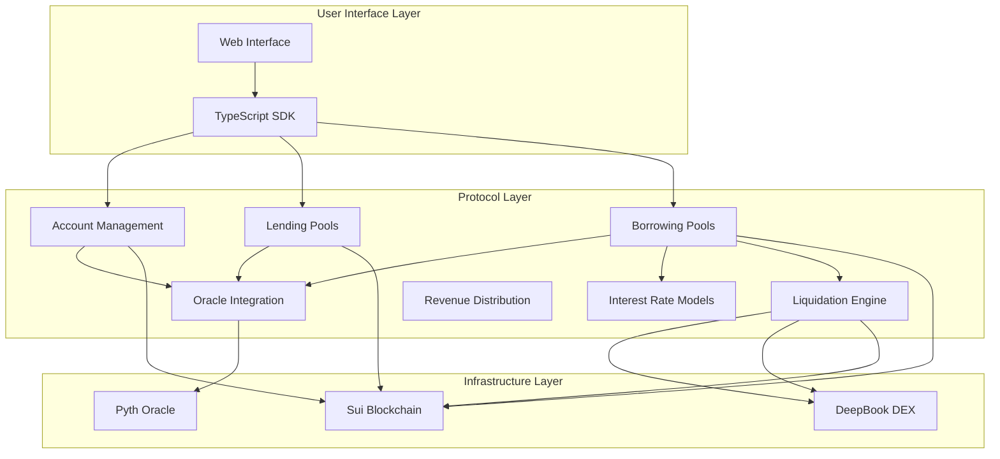
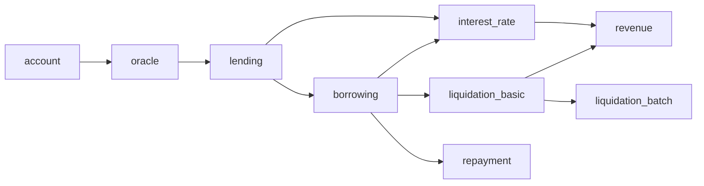

# Olend MVP Design Document

## Overview

Olend is a decentralized lending protocol built on Sui blockchain that implements unified liquidity pools with advanced borrowing mechanisms. The design follows a modular architecture with capability-based security, optimized for capital efficiency and gas performance. The system supports multiple collateral types, dynamic interest rates, and implements an innovative tick-based batch liquidation system.

## Architecture

### High-Level System Architecture



### Module Dependencies



## Components and Interfaces

### 1. Account Management Module (`account.move`)

#### Core Objects

```move
use sui::table::{Self, Table};
use std::type_name::{Self, TypeName};

/// Global registry for all user accounts
public struct AccountRegistry has key {
    id: UID,
    accounts: Table<address, ID>, // user_address -> account_id
    total_users: u64,
    version: u64,
}

/// Individual user account with position tracking
public struct Account has key {
    id: UID,
    owner: address,
    lending_positions: Table<TypeName, LendingPosition>,
    borrowing_positions: Table<ID, BorrowingPosition>, // pool_id -> position
    total_collateral_value: u64, // USD value with 8 decimals
    total_debt_value: u64, // USD value with 8 decimals
    health_factor: u64, // 8 decimal precision, 1.0 = 100000000
    created_at: u64,
    last_updated: u64,
}

/// Non-transferable capability for account access
public struct AccountCap has key, store {
    id: UID,
    account_id: ID,
    owner: address,
}

/// Position in lending pools
public struct LendingPosition has store, copy, drop {
    ytoken_balance: u64,
    underlying_deposited: u64,
    interest_earned: u64,
    last_interaction: u64,
}

/// Position in borrowing pools  
public struct BorrowingPosition has store {
    pool_id: ID,
    collateral_ytokens: Table<TypeName, u64>, // YToken type -> amount
    borrowed_amounts: Table<TypeName, u64>, // Asset type -> amount
    interest_rate: u64, // 8 decimal precision
    last_interest_update: u64,
    created_at: u64,
    health_factor: u64,
}
```

#### Key Functions

```move
/// Create a new user account with capability
public fun create_account(ctx: &mut TxContext): (Account, AccountCap) {
    let account_id = object::new(ctx);
    let account_uid = object::uid_to_inner(&account_id);
    
    let account = Account {
        id: account_id,
        owner: tx_context::sender(ctx),
        lending_positions: table::new(ctx),
        borrowing_positions: table::new(ctx),
        total_collateral_value: 0,
        total_debt_value: 0,
        health_factor: 0,
        created_at: tx_context::epoch_timestamp_ms(ctx),
        last_updated: tx_context::epoch_timestamp_ms(ctx),
    };
    
    let cap = AccountCap {
        id: object::new(ctx),
        account_id: account_uid,
        owner: tx_context::sender(ctx),
    };
    
    (account, cap)
}

/// Get account health factor
public fun get_account_health(account: &Account): u64 {
    account.health_factor
}

/// Update lending position (internal function)
fun update_lending_position(
    account: &mut Account, 
    cap: &AccountCap, 
    asset_type: TypeName,
    position: LendingPosition
) {
    assert!(cap.owner == account.owner, EInvalidAccountCap);
    
    if (table::contains(&account.lending_positions, asset_type)) {
        table::remove(&mut account.lending_positions, asset_type);
    };
    
    table::add(&mut account.lending_positions, asset_type, position);
    account.last_updated = tx_context::epoch_timestamp_ms(ctx);
}

/// Update borrowing position (internal function)  
fun update_borrowing_position(
    account: &mut Account,
    cap: &AccountCap,
    pool_id: ID,
    position: BorrowingPosition
) {
    assert!(cap.owner == account.owner, EInvalidAccountCap);
    
    if (table::contains(&account.borrowing_positions, pool_id)) {
        let old_position = table::remove(&mut account.borrowing_positions, pool_id);
        // Clean up old position resources
        table::destroy_empty(old_position.collateral_ytokens);
        table::destroy_empty(old_position.borrowed_amounts);
    };
    
    table::add(&mut account.borrowing_positions, pool_id, position);
    account.last_updated = tx_context::epoch_timestamp_ms(ctx);
}
```

### 2. Oracle Integration Module (`oracle.move`)

#### Core Objects

```move
use sui::table::{Self, Table};
use std::type_name::{Self, TypeName};

/// Oracle price feed manager
public struct OracleRegistry has key {
    id: UID,
    price_feeds: Table<TypeName, PriceFeed>,
    admin_cap: ID,
    staleness_threshold: u64, // seconds
    circuit_breaker_threshold: u64, // percentage change that triggers circuit breaker
}

/// Individual price feed configuration
public struct PriceFeed has store, copy, drop {
    pyth_price_id: vector<u8>,
    decimal_precision: u8,
    last_price: u64,
    last_update: u64,
    confidence_interval: u64,
    is_active: bool,
}

/// Price data with validation
public struct PriceData has copy, drop {
    price: u64, // USD price with 8 decimals
    confidence: u64,
    timestamp: u64,
    is_valid: bool,
}

/// Admin capability for oracle management
public struct OracleAdminCap has key, store {
    id: UID,
}
```

#### Key Functions

```move
/// Get current price for asset type T
public fun get_price<T>(registry: &OracleRegistry): PriceData {
    let asset_type = type_name::get<T>();
    assert!(table::contains(&registry.price_feeds, asset_type), EPriceFeedNotFound);
    
    let feed = table::borrow(&registry.price_feeds, asset_type);
    assert!(feed.is_active, EPriceFeedNotFound);
    
    // In real implementation, this would query Pyth oracle
    PriceData {
        price: feed.last_price,
        confidence: feed.confidence_interval,
        timestamp: feed.last_update,
        is_valid: validate_price_freshness(feed, tx_context::epoch_timestamp_ms(ctx)),
    }
}

/// Calculate USD value for given amount of asset T
public fun get_usd_value<T>(registry: &OracleRegistry, amount: u64): u64 {
    let price_data = get_price<T>(registry);
    assert!(price_data.is_valid, EPriceStale);
    
    // Calculate USD value with proper decimal handling
    (amount * price_data.price) / (10u64.pow(8)) // Assuming 8 decimal precision
}

/// Validate if price feed is fresh enough
public fun validate_price_freshness(feed: &PriceFeed, current_time: u64): bool {
    let time_diff = if (current_time > feed.last_update) {
        current_time - feed.last_update
    } else {
        0
    };
    
    time_diff <= registry.staleness_threshold
}

/// Update price feed (admin only)
public entry fun update_price_feed<T>(
    registry: &mut OracleRegistry,
    _admin_cap: &OracleAdminCap,
    new_price: u64,
    confidence: u64,
    ctx: &mut TxContext
) {
    let asset_type = type_name::get<T>();
    assert!(table::contains(&registry.price_feeds, asset_type), EPriceFeedNotFound);
    
    let feed = table::borrow_mut(&mut registry.price_feeds, asset_type);
    
    // Check for circuit breaker conditions
    let price_change_pct = if (feed.last_price > 0) {
        let diff = if (new_price > feed.last_price) {
            new_price - feed.last_price
        } else {
            feed.last_price - new_price
        };
        (diff * 10000) / feed.last_price // Calculate percentage with 2 decimal precision
    } else {
        0
    };
    
    assert!(price_change_pct <= registry.circuit_breaker_threshold, ECircuitBreakerTriggered);
    
    feed.last_price = new_price;
    feed.confidence_interval = confidence;
    feed.last_update = tx_context::epoch_timestamp_ms(ctx);
}
```

### 3. Liquidity Management Module (`liquidity.move`)

#### Core Objects

```move
use sui::balance::{Self, Balance};
use sui::table::{Self, Table};
use std::type_name::{Self, TypeName};

/// Unified liquidity pool for cross-protocol asset management
public struct LiquidityPool<phantom T> has key {
    id: UID,
    total_liquidity: Balance<T>,
    reserved_liquidity: u64, // Amount reserved for withdrawals
    utilization_rate: u64, // Current utilization percentage
    liquidity_providers: Table<address, LiquidityPosition>,
    total_shares: u64,
    last_rebalance: u64,
}

/// Individual liquidity provider position
public struct LiquidityPosition has store, copy, drop {
    shares: u64,
    deposited_amount: u64,
    rewards_earned: u64,
    last_interaction: u64,
}

/// Liquidity utilization tracking
public struct UtilizationTracker has store, copy, drop {
    lending_utilization: u64,
    borrowing_utilization: u64,
    total_available: u64,
    efficiency_score: u64,
}
```

#### Key Functions

```move
/// Add liquidity to the unified pool
public entry fun add_liquidity<T>(
    pool: &mut LiquidityPool<T>,
    deposit: Coin<T>,
    account: &mut Account,
    cap: &AccountCap,
    ctx: &mut TxContext
) {
    assert!(cap.owner == account.owner, EInvalidAccountCap);
    
    let deposit_amount = coin::value(&deposit);
    assert!(deposit_amount > 0, EInvalidDepositAmount);
    
    // Calculate shares based on current pool state
    let shares_to_mint = if (pool.total_shares == 0) {
        deposit_amount
    } else {
        (deposit_amount * pool.total_shares) / balance::value(&pool.total_liquidity)
    };
    
    // Add liquidity to pool
    let deposit_balance = coin::into_balance(deposit);
    balance::join(&mut pool.total_liquidity, deposit_balance);
    pool.total_shares = pool.total_shares + shares_to_mint;
    
    // Update provider position
    let provider_addr = tx_context::sender(ctx);
    if (table::contains(&pool.liquidity_providers, provider_addr)) {
        let position = table::borrow_mut(&mut pool.liquidity_providers, provider_addr);
        position.shares = position.shares + shares_to_mint;
        position.deposited_amount = position.deposited_amount + deposit_amount;
        position.last_interaction = tx_context::epoch_timestamp_ms(ctx);
    } else {
        let position = LiquidityPosition {
            shares: shares_to_mint,
            deposited_amount: deposit_amount,
            rewards_earned: 0,
            last_interaction: tx_context::epoch_timestamp_ms(ctx),
        };
        table::add(&mut pool.liquidity_providers, provider_addr, position);
    };
}

/// Remove liquidity from the unified pool
public entry fun remove_liquidity<T>(
    pool: &mut LiquidityPool<T>,
    shares_to_burn: u64,
    account: &mut Account,
    cap: &AccountCap,
    ctx: &mut TxContext
): Coin<T> {
    assert!(cap.owner == account.owner, EInvalidAccountCap);
    
    let provider_addr = tx_context::sender(ctx);
    assert!(table::contains(&pool.liquidity_providers, provider_addr), EPositionNotFound);
    
    let position = table::borrow_mut(&mut pool.liquidity_providers, provider_addr);
    assert!(position.shares >= shares_to_burn, EInsufficientShares);
    
    // Calculate withdrawal amount
    let withdrawal_amount = (shares_to_burn * balance::value(&pool.total_liquidity)) / pool.total_shares;
    let available_liquidity = balance::value(&pool.total_liquidity) - pool.reserved_liquidity;
    assert!(withdrawal_amount <= available_liquidity, EInsufficientLiquidity);
    
    // Update position
    position.shares = position.shares - shares_to_burn;
    position.last_interaction = tx_context::epoch_timestamp_ms(ctx);
    
    // Remove position if no shares left
    if (position.shares == 0) {
        table::remove(&mut pool.liquidity_providers, provider_addr);
    };
    
    // Update pool state
    pool.total_shares = pool.total_shares - shares_to_burn;
    let withdrawal_balance = balance::split(&mut pool.total_liquidity, withdrawal_amount);
    
    coin::from_balance(withdrawal_balance, ctx)
}

/// Allocate liquidity for lending operations
public fun allocate_for_lending<T>(
    pool: &mut LiquidityPool<T>,
    amount: u64
): Balance<T> {
    let available = balance::value(&pool.total_liquidity) - pool.reserved_liquidity;
    assert!(amount <= available, EInsufficientLiquidity);
    
    pool.reserved_liquidity = pool.reserved_liquidity + amount;
    update_utilization_rate(pool);
    
    balance::split(&mut pool.total_liquidity, amount)
}

/// Return liquidity from lending operations
public fun return_from_lending<T>(
    pool: &mut LiquidityPool<T>,
    returned_balance: Balance<T>,
    reserved_amount: u64
) {
    balance::join(&mut pool.total_liquidity, returned_balance);
    pool.reserved_liquidity = pool.reserved_liquidity - reserved_amount;
    update_utilization_rate(pool);
}

/// Update utilization rate based on current usage
fun update_utilization_rate<T>(pool: &mut LiquidityPool<T>) {
    let total_liquidity = balance::value(&pool.total_liquidity);
    if (total_liquidity > 0) {
        pool.utilization_rate = (pool.reserved_liquidity * 100000000) / total_liquidity;
    } else {
        pool.utilization_rate = 0;
    };
}
```

### 4. Unified Lending Module (`lending.move`)

#### Core Objects

```move
use sui::balance::{Self, Balance};
use sui::coin::{Self, Coin};

/// Unified liquidity pool for each asset type
public struct LendingPool<phantom T> has key {
    id: UID,
    total_deposits: Balance<T>,
    total_ytokens: u64,
    exchange_rate: u64, // 8 decimal precision
    interest_rate_model: InterestRateModel,
    last_interest_update: u64,
    total_borrowed: u64,
    reserve_factor: u64, // percentage for protocol revenue
    is_paused: bool,
}

/// Yield-bearing token representing pool shares
public struct YToken<phantom T> has key, store {
    id: UID,
    balance: u64,
}

/// Interest rate model configuration
public struct InterestRateModel has store, copy, drop {
    base_rate: u64, // 8 decimal precision
    optimal_utilization: u64, // 8 decimal precision  
    slope1: u64, // rate below optimal utilization
    slope2: u64, // rate above optimal utilization
    reserve_factor: u64,
}

/// Pool statistics for external queries
public struct PoolStats has copy, drop {
    total_deposits: u64,
    total_borrowed: u64,
    utilization_rate: u64,
    supply_rate: u64,
    borrow_rate: u64,
    exchange_rate: u64,
}
```

#### Key Functions

```move
/// Deposit assets and receive YTokens
public entry fun deposit<T>(
    pool: &mut LendingPool<T>,
    deposit_coin: Coin<T>,
    account: &mut Account,
    cap: &AccountCap,
    ctx: &mut TxContext
): YToken<T> {
    assert!(!pool.is_paused, EPoolPaused);
    assert!(cap.owner == account.owner, EInvalidAccountCap);
    
    let deposit_amount = coin::value(&deposit_coin);
    assert!(deposit_amount > 0, EInvalidDepositAmount);
    
    // Update interest rates before processing deposit
    update_interest_rates(pool, ctx);
    
    // Calculate YTokens to mint based on current exchange rate
    let ytokens_to_mint = if (pool.total_ytokens == 0) {
        deposit_amount // 1:1 ratio for first deposit
    } else {
        (deposit_amount * pool.total_ytokens) / balance::value(&pool.total_deposits)
    };
    
    // Add deposit to pool
    let deposit_balance = coin::into_balance(deposit_coin);
    balance::join(&mut pool.total_deposits, deposit_balance);
    pool.total_ytokens = pool.total_ytokens + ytokens_to_mint;
    
    // Create YToken for user
    let ytoken = YToken<T> {
        id: object::new(ctx),
        balance: ytokens_to_mint,
    };
    
    // Update user's lending position
    let asset_type = type_name::get<T>();
    let position = if (table::contains(&account.lending_positions, asset_type)) {
        let mut existing = table::remove(&mut account.lending_positions, asset_type);
        existing.ytoken_balance = existing.ytoken_balance + ytokens_to_mint;
        existing.underlying_deposited = existing.underlying_deposited + deposit_amount;
        existing.last_interaction = tx_context::epoch_timestamp_ms(ctx);
        existing
    } else {
        LendingPosition {
            ytoken_balance: ytokens_to_mint,
            underlying_deposited: deposit_amount,
            interest_earned: 0,
            last_interaction: tx_context::epoch_timestamp_ms(ctx),
        }
    };
    
    table::add(&mut account.lending_positions, asset_type, position);
    account.last_updated = tx_context::epoch_timestamp_ms(ctx);
    
    ytoken
}

/// Withdraw assets by burning YTokens
public entry fun withdraw<T>(
    pool: &mut LendingPool<T>,
    ytoken: YToken<T>,
    account: &mut Account,
    cap: &AccountCap,
    ctx: &mut TxContext
): Coin<T> {
    assert!(!pool.is_paused, EPoolPaused);
    assert!(cap.owner == account.owner, EInvalidAccountCap);
    
    let YToken { id, balance: ytoken_amount } = ytoken;
    object::delete(id);
    
    assert!(ytoken_amount > 0, EInvalidWithdrawAmount);
    
    // Update interest rates before processing withdrawal
    update_interest_rates(pool, ctx);
    
    // Calculate underlying assets to return
    let underlying_amount = (ytoken_amount * balance::value(&pool.total_deposits)) / pool.total_ytokens;
    assert!(underlying_amount <= balance::value(&pool.total_deposits), EInsufficientLiquidity);
    
    // Remove assets from pool
    let withdraw_balance = balance::split(&mut pool.total_deposits, underlying_amount);
    pool.total_ytokens = pool.total_ytokens - ytoken_amount;
    
    // Update user's lending position
    let asset_type = type_name::get<T>();
    assert!(table::contains(&account.lending_positions, asset_type), EPositionNotFound);
    
    let mut position = table::remove(&mut account.lending_positions, asset_type);
    assert!(position.ytoken_balance >= ytoken_amount, EInsufficientBalance);
    
    position.ytoken_balance = position.ytoken_balance - ytoken_amount;
    position.last_interaction = tx_context::epoch_timestamp_ms(ctx);
    
    if (position.ytoken_balance > 0) {
        table::add(&mut account.lending_positions, asset_type, position);
    };
    
    account.last_updated = tx_context::epoch_timestamp_ms(ctx);
    
    coin::from_balance(withdraw_balance, ctx)
}

/// Calculate current exchange rate
public fun calculate_exchange_rate<T>(pool: &LendingPool<T>): u64 {
    if (pool.total_ytokens == 0) {
        100000000 // 1.0 with 8 decimal precision
    } else {
        (balance::value(&pool.total_deposits) * 100000000) / pool.total_ytokens
    }
}

/// Update interest rates based on utilization
fun update_interest_rates<T>(pool: &mut LendingPool<T>, ctx: &mut TxContext) {
    let current_time = tx_context::epoch_timestamp_ms(ctx);
    let time_elapsed = current_time - pool.last_interest_update;
    
    if (time_elapsed > 0) {
        let utilization = get_utilization_rate(pool.total_borrowed, balance::value(&pool.total_deposits));
        let borrow_rate = calculate_borrow_rate(&pool.interest_rate_model, utilization);
        
        // Accrue interest to total deposits
        if (pool.total_borrowed > 0) {
            let interest_accrued = (pool.total_borrowed * borrow_rate * time_elapsed) / (365 * 24 * 60 * 60 * 1000 * 100000000);
            // In real implementation, this would mint new tokens to represent accrued interest
        };
        
        pool.last_interest_update = current_time;
    }
}
```

### 4. Single-Asset Borrowing Module (`borrowing.move`)

#### Core Objects

```move
/// Single collateral, single borrow asset pool
struct BorrowingPool<phantom C, phantom T> has key {
    id: UID,
    collateral_factor: u64, // max 90% for volatile, 95% for stable
    liquidation_threshold: u64, // typically 5% below collateral_factor
    liquidation_bonus: u64, // 5-10% bonus for liquidators
    interest_rate_model: InterestRateModel,
    total_collateral: u64, // in YToken<C> units
    total_borrowed: u64, // in T units
    positions_by_health: Table<u64, vector<ID>>, // health_factor -> position_ids
    is_active: bool,
    created_at: u64
}

/// Borrowing position tracking
struct Position has key {
    id: UID,
    borrower: address,
    pool_id: ID,
    collateral_amount: u64, // YToken<C> amount
    borrowed_amount: u64, // T amount
    interest_rate: u64,
    last_interest_update: u64,
    health_factor: u64,
    created_at: u64
}
```

#### Key Functions

```move
public fun create_pool<C, T>(collateral_factor: u64, liquidation_threshold: u64, ...): BorrowingPool<C, T>
public fun borrow<C, T>(pool: &mut BorrowingPool<C, T>, collateral: YToken<C>, borrow_amount: u64, ...): (Coin<T>, Position)
public fun calculate_health_factor<C, T>(pool: &BorrowingPool<C, T>, position: &Position, oracle: &OracleRegistry): u64
public fun update_position_health<C, T>(pool: &mut BorrowingPool<C, T>, position: &mut Position, ...)
```

### 5. Interest Rate Management Module (`interest_rate.move`)

#### Core Objects

```move
/// Kinked interest rate model implementation
struct KinkedRateModel has store {
    base_rate_per_second: u64,
    multiplier_per_second: u64, // slope1
    jump_multiplier_per_second: u64, // slope2  
    optimal_utilization: u64,
    reserve_factor: u64
}

/// Interest calculation utilities
struct InterestCalculator has drop {
    principal: u64,
    rate_per_second: u64,
    time_elapsed: u64,
    compound_factor: u64
}
```

#### Key Functions

```move
public fun calculate_borrow_rate(model: &KinkedRateModel, utilization: u64): u64
public fun calculate_supply_rate(borrow_rate: u64, utilization: u64, reserve_factor: u64): u64
public fun compound_interest(principal: u64, rate_per_second: u64, time_elapsed: u64): u64
public fun get_utilization_rate(total_borrowed: u64, total_deposits: u64): u64
```

### 6. Basic Liquidation Module (`liquidation_basic.move`)

#### Core Objects

```move
/// Liquidation engine for managing underwater positions
struct LiquidationEngine has key {
    id: UID,
    liquidation_incentive: u64, // bonus percentage for liquidators
    close_factor: u64, // max percentage of debt that can be liquidated
    min_health_factor: u64, // threshold for liquidation eligibility
    liquidator_registry: Table<address, LiquidatorInfo>
}

/// Liquidator information and statistics
struct LiquidatorInfo has store {
    total_liquidations: u64,
    total_volume: u64,
    reputation_score: u64,
    is_active: bool
}

/// Liquidation event data
struct LiquidationEvent has copy, drop {
    position_id: ID,
    liquidator: address,
    collateral_seized: u64,
    debt_repaid: u64,
    liquidation_bonus: u64,
    timestamp: u64
}
```

#### Key Functions

```move
public fun liquidate_position<C, T>(engine: &mut LiquidationEngine, pool: &mut BorrowingPool<C, T>, position: &mut Position, repay_amount: u64): LiquidationEvent
public fun calculate_liquidation_amounts<C, T>(position: &Position, repay_amount: u64, oracle: &OracleRegistry): (u64, u64)
public fun is_liquidatable(health_factor: u64, threshold: u64): bool
```

## Data Models

### Position Health Calculation

The health factor is calculated as:
```
health_factor = (collateral_value * liquidation_threshold) / total_debt_value
```

Where:
- `collateral_value`: USD value of all collateral assets
- `liquidation_threshold`: Maximum LTV ratio (e.g., 0.85 for 85%)
- `total_debt_value`: USD value of all borrowed assets including accrued interest

### Interest Rate Calculation

The kinked interest rate model:

```
if utilization <= optimal_utilization:
    borrow_rate = base_rate + (utilization * slope1) / optimal_utilization
else:
    borrow_rate = base_rate + slope1 + ((utilization - optimal_utilization) * slope2) / (1 - optimal_utilization)

supply_rate = borrow_rate * utilization * (1 - reserve_factor)
```

### Exchange Rate Calculation

For YTokens:
```
exchange_rate = (total_underlying + accrued_interest) / total_ytokens
```

## Error Handling

### Custom Error Codes

```move
module olend::errors {
    // Account errors (1000-1099)
    const EAccountNotFound: u64 = 1001;
    const EInvalidAccountCap: u64 = 1002;
    const EAccountAlreadyExists: u64 = 1003;
    const EPositionNotFound: u64 = 1004;
    const EInsufficientBalance: u64 = 1005;

    // Oracle errors (1100-1199)  
    const EPriceStale: u64 = 1101;
    const EPriceFeedNotFound: u64 = 1102;
    const EInvalidPriceData: u64 = 1103;
    const ECircuitBreakerTriggered: u64 = 1104;

    // Lending errors (1200-1299)
    const EInsufficientLiquidity: u64 = 1201;
    const EPoolPaused: u64 = 1202;
    const EInvalidWithdrawAmount: u64 = 1203;
    const EInvalidDepositAmount: u64 = 1204;

    // Borrowing errors (1300-1399)
    const EInsufficientCollateral: u64 = 1301;
    const EBorrowCapExceeded: u64 = 1302;
    const EInvalidCollateralType: u64 = 1303;
    const ESameAssetType: u64 = 1304;
    const EHealthFactorTooLow: u64 = 1305;

    // Liquidation errors (1400-1499)
    const EPositionHealthy: u64 = 1401;
    const EInvalidLiquidationAmount: u64 = 1402;
    const ELiquidationFailed: u64 = 1403;
    const EInsufficientLiquidationIncentive: u64 = 1404;

    // Math errors (1500-1599)
    const EMathOverflow: u64 = 1501;
    const EMathUnderflow: u64 = 1502;
    const EDivisionByZero: u64 = 1503;
}
```

### Error Recovery Mechanisms

1. **Circuit Breakers**: Automatic pausing when price deviations exceed thresholds
2. **Graceful Degradation**: Fallback to cached prices when oracle is unavailable
3. **Transaction Rollback**: Atomic operations with proper state restoration
4. **Emergency Pause**: Admin capability to pause specific modules

## Testing Strategy

### Unit Testing Approach

1. **Pure Function Testing**: Mathematical calculations (interest, health factors)
2. **State Transition Testing**: Account updates, position changes
3. **Error Condition Testing**: Invalid inputs, edge cases
4. **Integration Testing**: Cross-module interactions

### Test Coverage Requirements

- **95% code coverage** for all public functions
- **Property-based testing** for mathematical functions
- **Fuzz testing** for input validation
- **Stress testing** for liquidation scenarios

### Test Data Management

```move
#[test_only]
struct TestScenario {
    accounts: vector<TestAccount>,
    pools: vector<TestPool>,
    oracle_prices: Table<TypeName, u64>,
    timestamp: u64
}

#[test_only]
public fun setup_test_environment(): TestScenario
```

## Security Considerations

### Access Control

1. **Capability-based Security**: AccountCap for user operations
2. **Admin Capabilities**: Separate caps for different admin functions
3. **Multi-signature Requirements**: Critical parameter changes
4. **Time-locked Upgrades**: Delayed execution for major changes

### Economic Security

1. **Collateralization Ratios**: Conservative ratios to prevent undercollateralization
2. **Liquidation Incentives**: Balanced incentives for timely liquidations
3. **Interest Rate Bounds**: Maximum and minimum rate limits
4. **Oracle Validation**: Multiple price sources and staleness checks

### Technical Security

1. **Overflow Protection**: SafeMath operations for all calculations
2. **Reentrancy Guards**: Prevention of recursive calls
3. **Input Validation**: Comprehensive parameter checking
4. **State Consistency**: Atomic operations with proper rollback

## Performance Optimizations

### Gas Optimization

1. **Batch Operations**: Multiple deposits/withdrawals in single transaction
2. **Efficient Data Structures**: Tables for O(1) lookups
3. **Minimal Storage**: Packed structs and efficient encoding
4. **Lazy Evaluation**: Interest calculation only when needed

### Scalability Considerations

1. **Horizontal Scaling**: Multiple pools for same asset pairs
2. **Position Grouping**: Tick-based organization for efficient liquidation
3. **Event-driven Updates**: Asynchronous position health monitoring
4. **Caching Strategies**: Frequently accessed data optimization

## Integration Points

### External Dependencies

1. **Pyth Oracle**: Real-time price feeds with confidence intervals
2. **DeepBook DEX**: Liquidation asset disposal and market making
3. **Sui Framework**: Core blockchain functionality and standards

### API Design

```move
module olend::api {
    use sui::coin::Coin;
    
    /// Composite operation: deposit and borrow in single transaction
    public entry fun deposit_and_borrow<C, T>(
        lending_pool: &mut LendingPool<C>,
        borrowing_pool: &mut BorrowingPool<C, T>,
        deposit_coin: Coin<C>,
        borrow_amount: u64,
        account: &mut Account,
        cap: &AccountCap,
        oracle: &OracleRegistry,
        ctx: &mut TxContext
    ) {
        // Implementation would combine deposit and borrow operations atomically
        abort 0 // Placeholder
    }

    /// Composite operation: repay and withdraw in single transaction  
    public entry fun repay_and_withdraw<C, T>(
        lending_pool: &mut LendingPool<C>,
        borrowing_pool: &mut BorrowingPool<C, T>,
        repay_coin: Coin<T>,
        ytoken_amount: u64,
        account: &mut Account,
        cap: &AccountCap,
        ctx: &mut TxContext
    ) {
        // Implementation would combine repay and withdraw operations atomically
        abort 0 // Placeholder
    }

    /// Batch liquidation for multiple positions
    public entry fun liquidate_batch(
        liquidation_engine: &mut LiquidationEngine,
        position_ids: vector<ID>,
        repay_amounts: vector<u64>,
        ctx: &mut TxContext
    ) {
        // Implementation would process multiple liquidations efficiently
        abort 0 // Placeholder
    }

    // View functions for UI/analytics
    
    /// Get comprehensive account summary
    public fun get_account_summary(account: &Account): AccountSummary {
        AccountSummary {
            owner: account.owner,
            total_collateral_value: account.total_collateral_value,
            total_debt_value: account.total_debt_value,
            health_factor: account.health_factor,
            lending_positions_count: table::length(&account.lending_positions),
            borrowing_positions_count: table::length(&account.borrowing_positions),
        }
    }

    /// Get borrowing pool statistics
    public fun get_pool_statistics<C, T>(pool: &BorrowingPool<C, T>): PoolStats {
        PoolStats {
            total_collateral: pool.total_collateral,
            total_borrowed: pool.total_borrowed,
            utilization_rate: if (pool.total_collateral > 0) {
                (pool.total_borrowed * 100000000) / pool.total_collateral
            } else { 0 },
            collateral_factor: pool.collateral_factor,
            liquidation_threshold: pool.liquidation_threshold,
        }
    }

    /// Calculate maximum borrowing capacity
    public fun calculate_borrowing_capacity<C, T>(
        pool: &BorrowingPool<C, T>,
        collateral_amount: u64,
        oracle: &OracleRegistry
    ): u64 {
        let collateral_value = oracle::get_usd_value<C>(oracle, collateral_amount);
        let max_borrow_value = (collateral_value * pool.collateral_factor) / 100000000;
        
        // Convert USD value back to asset T amount
        let asset_price = oracle::get_price<T>(oracle);
        (max_borrow_value * 100000000) / asset_price.price
    }

    /// Account summary structure
    public struct AccountSummary has copy, drop {
        owner: address,
        total_collateral_value: u64,
        total_debt_value: u64,
        health_factor: u64,
        lending_positions_count: u64,
        borrowing_positions_count: u64,
    }
}
```

This design provides a robust foundation for the Olend MVP with clear separation of concerns, comprehensive error handling, and optimization for the Sui blockchain environment.